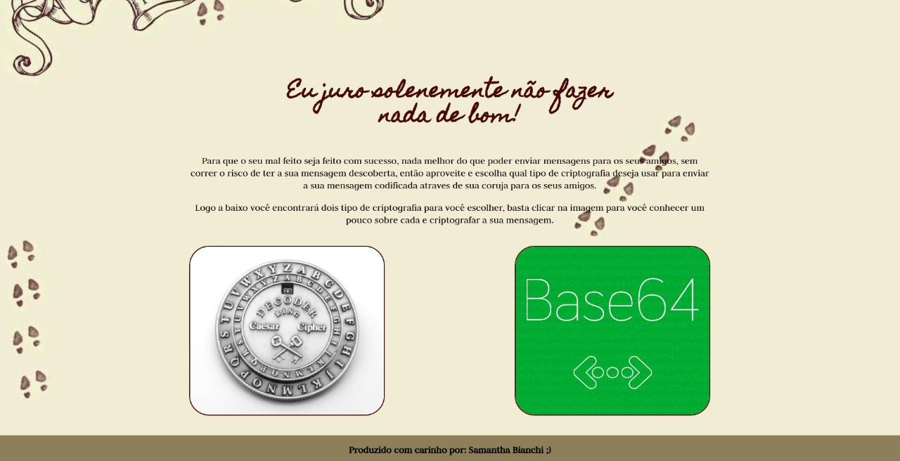
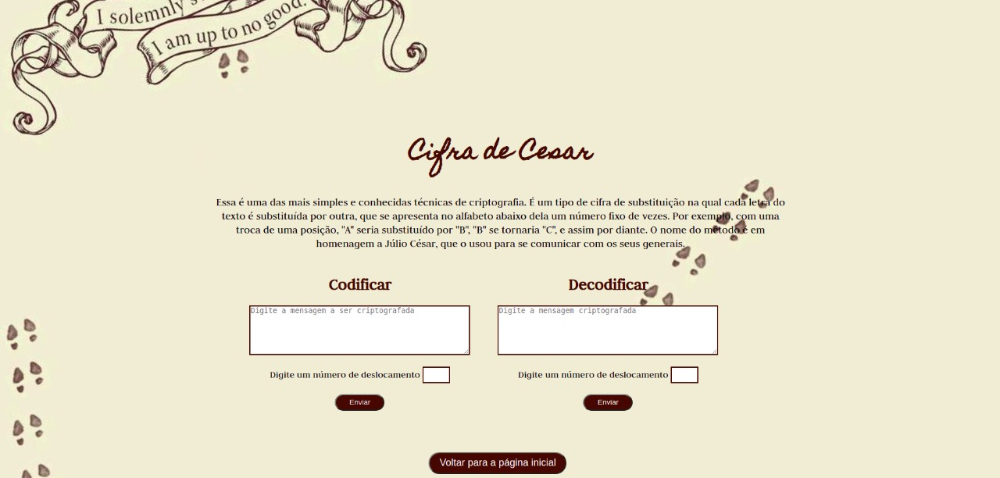
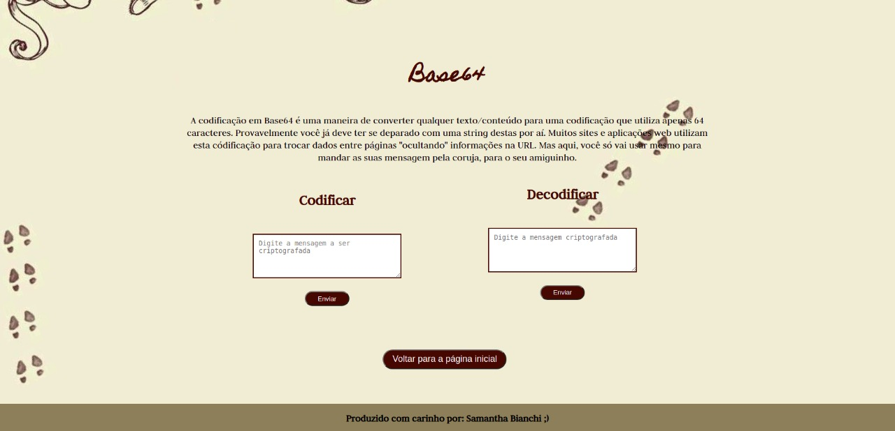

## CIFRADOR MAPA DO MAROTO

Esse é um projeto de melhoria de um exercício que foi passado no Módulo 1 do Bootcamp de Web Dev FullStack da Resilia Educação.

O projeto consiste em criptografar e descriptografar mensagens utilizando a Cifra de César e Base64.

O designer do projeto foi inspirado no Mapa do Maroto, do filme do Harry Potter que após ser utilizado, ele fica em branco não deixando que mais ninguém além da pessoa que tem as palavras mágicas veja o conteúdo. Aqui você pode criptografar as suas mensagens para serem enviadas pela sua coruja para seus amigos.

Você pode testar e criptografar as suas mensagens [aqui](https://sahbianchi.github.io/mapaDoMaroto/)
 

## ✏️ Produto | Processo Criativo

Home

    

 

Cifra de Cesar

    

 

Base64

    

 

## ✒️ Autora

Esse projeto foi pensado e idealizado por mim **Samantha Bianchi** e você pode conhecer mais outros projetos meus aqui no meu [GitHub](https://github.com/SahBianchi) e no meu [Linkedin](https://www.linkedin.com/in/sahbianchi/)
